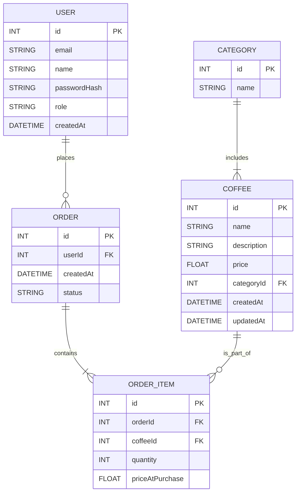

# 📊 Entity Relationship Diagram: Coffee Shop

---

## 🗂 Example Use Cases Mapped to ERD

| Use Case                  | Tables Involved                        |
| ------------------------- | -------------------------------------- |
| Customer registers        | `User`                                 |
| Admin adds new coffee     | `Coffee`, `Category`                   |
| Customer places order     | `User`, `Order`, `OrderItem`, `Coffee` |
| Filter coffee by category | `Coffee`, `Category`                   |
