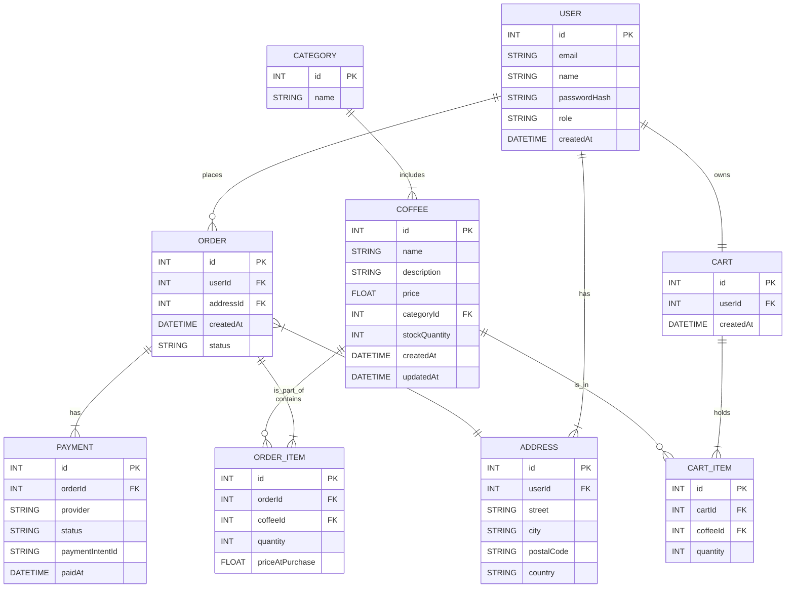

# 📊 Entity Relationship Diagram: Coffee Shop

---

## 🗂 Example Use Cases Mapped to ERD

| Use Case                        | Tables Involved                                              |
| ------------------------------- | ------------------------------------------------------------ |
| Customer registers              | `User`                                                       |
| Admin adds new coffee           | `Coffee`, `Category`                                         |
| Customer places order           | `User`, `Order`, `OrderItem`, `Coffee`, `Address`, `Payment` |
| Add item to cart                | `User`, `Cart`, `CartItem`, `Coffee`                         |
| Checkout and pay                | `Cart`, `CartItem`, `Order`, `OrderItem`, `Payment`          |
| Track stock availability        | `Coffee`                                                     |
| Filter coffee by category       | `Coffee`, `Category`                                         |
| View past orders                | `User`, `Order`, `OrderItem`                                 |
| Admin updates product inventory | `Coffee`                                                     |
| Customer updates address        | `Address`, `User`                                            |
